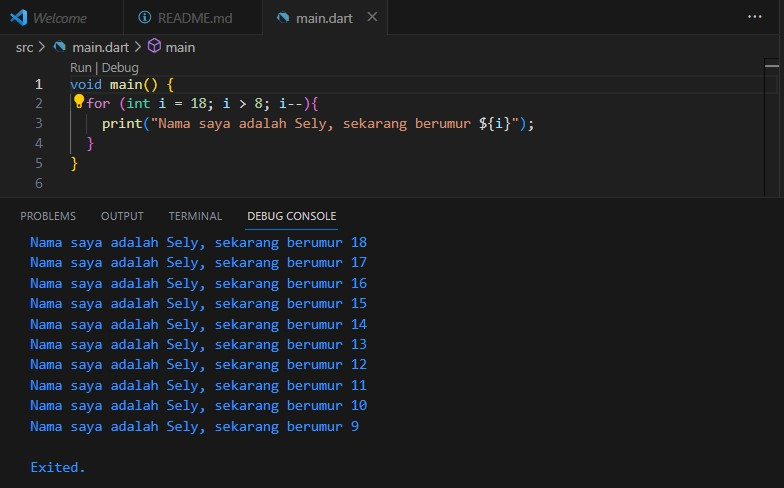

## Author [@selyraa](https://github.com/selyraa)

# Tugas Praktikum

### Soal 1
Modifikasilah kode pada baris 3 di VS Code atau Editor Code favorit Anda berikut ini agar mendapatkan keluaran (output) sesuai yang diminta!

Output yang diminta:

### Jawab

### Soal 2

Mengapa sangat penting untuk memahami bahasa pemrograman Dart sebelum kita menggunakan framework Flutter ? Jelaskan!

### Jawab

Menurut saya mempelajarai bahasa pemrograman Dart sebelum menggunakan framework Flutter sangat penting untuk memperkuat pemahamaman dasar kita. Karena dalam framework Flutter nantinya akan menggunakan bahasa Dart, sehingga jika kita belum memahami bahasa Dart akan sangat menyulitkan dan kemungkinan membuat proses belajar kita menjadi lambat karena belum memahami dasar atau konsepnya dengan baik.

### Soal 3

Rangkumlah materi dari codelab ini menjadi poin-poin penting yang dapat Anda gunakan untuk membantu proses pengembangan aplikasi mobile menggunakan framework Flutter.

### Jawab

### Apa itu Dart?
Bahasa Dart merupakan inti dari framework Flutter yang merupakan bahasa modern tingkat tinggi, yang dipergunakan untuk membangun aplikasi mobile. Memahami konsep Dart merupakan langkah awal untuk bekerja dengan Flutter, karena pada dasarnya framework Flutter menggunakan bahasa Dart untuk menjalankannya. 

### Fitur apa saja yang ada pada Dart?
• *Productive tooling*, merupakan fitur untuk menganalisis kode, plugin IDE, dan ekosistem paket yang besar.

• *Garbage collection*, sebagai pengelola dan menangani dealokasi memori (memori yang sudah tidak terpakai).

• *Type annotations* (opsional), sebagai pengaman dan pengontrol data dalam aplikasi.

• *Statically typed*, sebagai pengaman selain dari *type annotations*, Dart memiliki fitur *type-safe* dan *type-inference*. Fitur ini digunakan untuk menemukan *bug* disaat proses kompilasi kode. 

• *Portability*, bahasa Dart bersifat portabel, yang tidk hanya digunakan unutk web (diterjemahkan ke *JavaScript*), tetapi dapat dikompilasi secara *native* ke kode Advanced RISC Machine (ARM) dan x86.

### Mengenal Sejarah Singkat Dart

Dart telah berkembang sejak 2011, yang kemudian merilis versi stabilnya pada tahun 2013. Selain itu perkembangan Dart juga terjadi ketika dirilisnya Dart 2.0 pada akhir 2018. Untuk lebih jelas, mari simak penjelasan berikut!

• Pada awalnya fokus utamanya adalah pengembangan *web*, yang memiliki tujuan untuk menggantikan *JavaScript*, namun sekarang telah fokus pada mobile development, termasuk framework Flutter.

• Dart ingin menjadi penerus *JavaScript*, dengan cara mencoba untuk memecahkan permasalahan yang ada pada *JavaScript*, karena *JavaScript* tidak menyediakan ketahanan seperti bahasa pemrograman lainnya.

• Dari segi performa, Dart didukung oleh piranti yang modern dan stabil, sehingga mampu menawarkan performa terbaik sebagai alat yang menunjang pengembangan proyek berskala besar.

• Memiliki sifat yang fleksibel dan kuat atau tangguh.

Dari peningkatan fitur - fitur yang dimilikinya menjadikan Dart sebagai bahasa modern yang luar biasa. Oleh sebab itulah tim Flutter Framework memilih Dart sebagai bahasa yang digunakan.

### Bagaimana Dart Bekerja?

Masih mempertahankan sifatnya yang fleksibel, Dart dapat dieksekusi menggunakan dua cara, yaitu Dart Virtual Machine dan JavaScript compilation.

Kode Dart dapat dieksekusi pada lingkungan yang mendukung bahasa Dart, yang perlu memperhatikan beberapa fitur berikut:

• *Runtime systems*

• *Dart core libraries*

• *Garbage collectors*

Untuk mengeksekusi kode Dart maka dapat dilakukan dalam dua mode, yakni Just-In-Time (JIT) atau Ahead-Of-Time (AOT). Berikut adalah penjelasannya:

• Kompilasi JIT adalah kompilasai yang dilakukan sesuai dengan kebutuhan. Dart VM memuat dan mengompilasi kode sumber ke kode mesin asli (*native*). Hal ini digunakan untuk menjalankan kode pada *command line* atau selama proses pengembangan aplikasi mobile yang dapat memanfaatkan fitur *debugging* dan *hot reload*.

• Kompilasi AOT adalah kompilasi yang tidak menyediakan fitur *debugging* dan *hot reload* seperti yang dimiliki kompilasi JIT. VM akan menyediakan *garbage collector* dan metode-metode *native* dari Dart SDK pada aplikasi. Tentunya dengan hal ini performa yang dihasilkan jauh lebih besar dari JIT.

### Object Orientation

Dart juga dirancang untuk object-oriented (OO), yang didasarkan pada konsep objek, yang mana memiliki fields dan methods. Prinsip OO ini memastikan bahwa Dart memiliki fitur encapsulation, inheritance, composition, abstraction, dan polymorphism.

### Operator Standar Dart

Operator yang dimiliki Dart berguna untuk memanipulasi variabel. Terdapat beberapa jenis operator yang dapat digunakan, antara lain:

### 1. Arithmetic Operators

• + untuk penambahan

• - untuk pengurangan

• * untuk perkalian

• / untuk pembagian

• ~/ untuk pembagian bilangan bulat

• % untuk operasi modulus

### 2. Increment and Decrement Operators

• ++var atau var++, untuk menambah nilai var sebesar 1

• --var atau var--, untuk mengurangi nilai var sebesar 1

### 3. Equality and Relational Operators

Persamaan atau perbandingan dapat dilakukan dengan operator berikut ini:

• == untuk memeriksa apakah nilai yang dibandingkan sama

• != untuk memeriksa apakah nilai yang dibandingkan berbeda

Namun untuk melakukan pengujian relasional, maka dapat menggunakan operator berikut:

• > untuk memeriksa apakah operan kiri lebih besar dari operan kanan

• < untuk memeriksa apakah operan kiri lebih kecil dari operan kanan

• >= untuk memeriksa apakah operan kiri lebih besar dari atau sama dengan operan kanan

• <= untuk memeriksa apakah operan kiri lebih kecil dari atau sama dengan operan kanan

### 4. Logical Operators

• !expresion --> negasi atau kebalikan hasil ekspresi, yang akan merubah true menjadi false, serta kebalikannya.

• || menerapkan operasi logika OR antara dua ekspresi

• && menerapkan operasi logika AND antara dua ekspresi

### Soal 4

Buatlah slide yang berisi penjelasan dan contoh eksekusi kode tentang perbedaan Null Safety dan Late variabel ! (Khusus soal ini kelompok berupa link google slide)

### Jawab

Untuk jawaban nomor 4 dapat dicek [disini](https://www.canva.com/design/DAFtc1gnyAw/edW7Zeoy_PVGPjMdD3qXfw/edit?utm_content=DAFtc1gnyAw&utm_campaign=designshare&utm_medium=link2&utm_source=sharebutton).