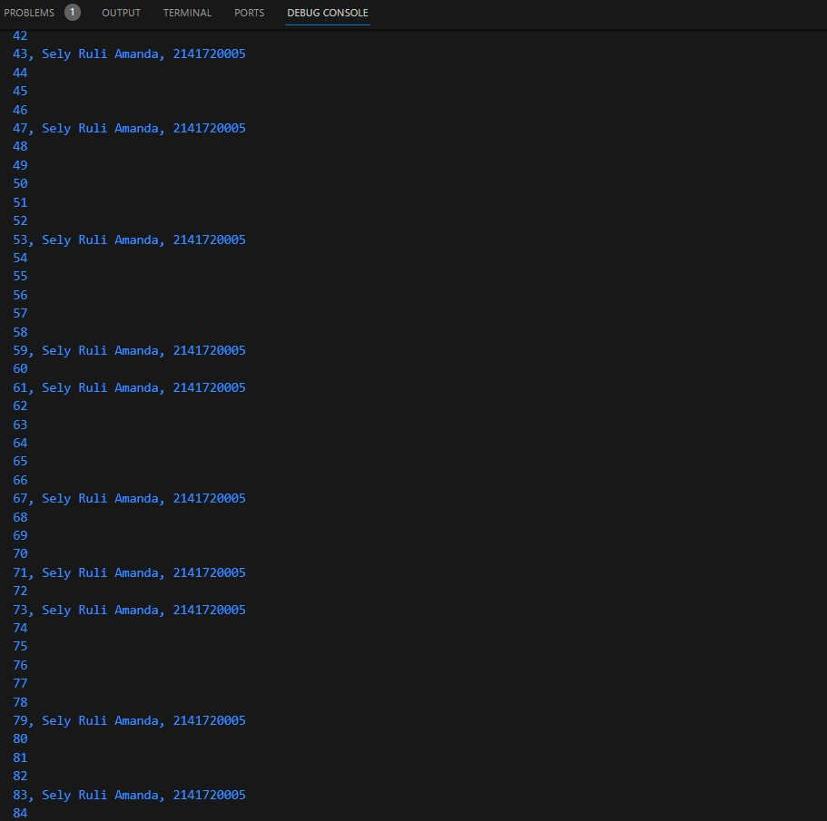

## Praktikum 1

### Hasil Running Langkah 1

### Hasil Running Langkah 3

Setelah dilakukan running maka akan terjadi error. Error yang dihasilkan menunjukkan bahwa value dari variabel test merupakan String, namun ketika dilakukan pengecekan pada if, didefinisikan sebagai Booelan, sehingga output tidak bisa dijalankan karena mencoba menbandingkan tipe data String dengan Boolean.

Berikut adalah output setelah dilakukan perbaikan. Perbaikan ini dapat dengan 2 macam, bisa mengubah variabel dengan nilai yang dibandingkan pada pengecekan kondisi if, sebagaimana berikut:

Atau bisa juga dengan mengubah tipe data menjadi bool. Namun kondisi ini akan menghasilkan dead code ketika ingin menampilkan hasil pada pengecekan else, sebagaimana berikut:

## Praktikum 2

### Hasil Running Langkah 2

Output menunjukkan error, yang mana error ini disebabkan oleh variabel counter belum didefinisikan sebelumnya. Sehingga untuk memperbaiki error tersebut maka harus melakukan inisialisasi variabel counter menggunakan tipe data int.

Pada kode program tersebut saya mendeklarasikan variabel counter menggunakan tipe data int, serta menginisialisasi nilainya dengan 20, sehingga output yang dihasilkan dimulai dari 20 hingga 32.

#### Hasil Running Langkah 3

Output menunjukkan tidak ada error, karena pada kode program ini saya ingin menampilkan perulangan menggunakan do-while dengan inisialisasi nilai counter dengan 80, namun pada perulangan terdapat kondisi counter < 77. Karena menggunakan do-while, maka nilai counter tetap ditampilkan satu kali meskipun tidak memenuhi kondisi.

## Praktikum 3

### Hasil Running Langkah 2

Sama dengan hasil running praktikum 2 di langkah 2 sebelumnya, terdapat error yang menandakan bahwa variabel Index dan index tidak dikenali karena belum dilakukan deklarasi. Disini terdapat inkonsisten dalam pemberian nama variabel, oleh karena itu perbaikan saya lakukan dengan melakukan deklarasi variabel index.

### Hasil Running Langkah 3

Output tersebut menunjukkan error, yanag mana banyak penulisan syntax yang kurang sesuai seperti if dan else yang diawali dengan huruf kapital, inkonsisten dalam penulisan variabel index, serta penulisan kode yang kurang lengkap, seperti kurung kurawal, dsb. Maka saya lakukan perbaikan dengan struktur kode sebagaimana berikut:

## Tugas Praktikum

Berikut merupakan hasil dari running program yang dapat menampilkan bilangan prima dari angka 0 sampai 201 menggunakan Dart. Ketika bilangan prima ditemukan, maka tampilkan nama lengkap dan NIM. Sedangkan jika selain bilangan prima akan ditampilkan bilangan itu sendiri.

