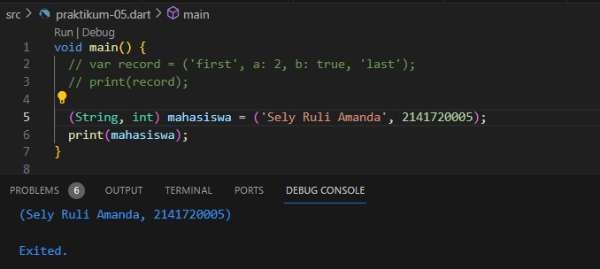

# Praktikum 1 - Eksperimen Tipe Data List

Setelah melakukan eksekusi dari kode di atas, akan dihasilkan output sebagaimana tampilan di bawah ini. Terdapat output 3,2,1. Hal ini dikarenakan pada awalnya, terdapat list yang berisi [1,2,3]. Kemudian dilakukan debugging apakah list.length = 3, jika benar maka akan dianggap 'true', kemudian dilanjutkan pada operasi selanjutnya. 

### Task Praktikum 1

Di sini saya menggunakan keyword final dengan type object List yang saya beri panjang 5, serta default value nya null. Kemudian pada indeks ke - 1 dan 2 masing-masing saya isi dengan nama dan NIM. Lalu saya lakukan debugging dengan assert untuk melakukan pengecekan apakah panjang serta elemen value di indeks tertentu telah benar. Kemudian print hasilnya, yang menunjukkan data nama dan NIM telah tersimpan pada indeks ke-1 dan 2.

# Praktikum 2 - Eksperimen Tipe Data Set

Eksekusi kode menghasilkan output sebagaimana berikut ini. Hal ini merupakan implementasi dari tipe data set, yang mana dalam satu varibel dapat diisi dengan banyak nilai yang bersifat unik dan tidak berurutan (tidak memiliki indeks).

### Task Praktikum 2

Selanjutnya menambahkan 2 variabel names1 dan names2. Dua variabel tersebut bertujuan untuk mendeklarasikan tipe data set, namun terdapat perbedaan stuktur. Kemudian pada ke dua variabel tersebut ditambahkan elemen nama dan NIM, dengan menggunakan fungsi .add() dan .addAll().

# Praktikum 3 - Eksperimen Tipe Data Maps

Hasil running code menunjukkan key:value dari variabel 'gifts' dan 'nobleGases'.

Selanjutnya menambahkan kode program seperti di bawah ini. Variabel mhs1 akan mengubah nilai gifts pada elemen fifth, begitu pula dengan variabel mhs2 yang mengubah nilai nobleGases pada elemen 18. Maka ketika dilakukan perintah print, nilai elemen yang diubah sudah berhasil diubah, serta akan menampilkan himpunan kosong dari variabel mhs1 dan mhs2, dikarenakan belum dilakukan inisialisasi nilai.

### Task Praktikum 3

Terdapat perbaikan dalam kode program sebelumnya, di sini dilakukan inisialisasi terhadap variabel mhs1 dan mhs2 sebagaimana tampilan di bawah.

Kemudian menambahkan elemen nama dan NIM pada tiap variabel. Perbedaan antara variabel gifts dan mhs1 terletak pada elemen fifth, dan nobleGases dengan mhs2 terletak pada elemen 18, dikarenakan telah dilakukan perubahan nilai elemen sebelumnya.

# Praktikum 4 - Eksperimen Tipe Data List: Spread dan Control-flow Operators

Terdapat error yang menunjukkan bahwa variabel list1 belum didefinisikan atau tidak dikenali, namun sudah dilakukan pemanggilan pada fungsi print.

Oleh karena itu dilakukan perbaikan sebagaimana berikut

Kemudian ditambahkan kode seperti tampilan di bawah ini, kemudian setelah di running terdapat error yang lagi-lagi menunjukkan belum dilakukannya deklarasi suatu variabel (list1) namun sudah dilakukan pemanggilan dalam operasi.

Oleh karena itu dilakukan perbaikan sebagaimana berikut

Kemudian menambahkan variabel list berisi NIM menggunakan Spread Operators. Di sini saya membuat var add, yang saya berisi NIM saya, kemudian saya tambahkan variabel list ke dalam variabel add.

Selanjutnya menambahkan kode berikut ini. Ketika di running terdapat error yang menunjukkan bahwa var promoActive tidak dikenali karena belum dideklarasikan.

Oleh karena itu dilakukan perbaikan dengan mendeklarasikan var promoActive, kemudian diberi nilai true, maka akan menghasilkan output yang menunjukkan elemen 'Outlet' ikut ditampilkan.

Namun ketika nilai dari var promoActive diubah menjadi false, maka elemen 'Outlet' tidak ditampilkan.

Selanjutnya menambahkan kode berikut ini. Ketika di running terdapat error yang menunjukkan bahwa var login tidak dikenali karena belum dideklarasikan. 

Oleh karena itu dilakukan perbaikan dengan mendeklarasikan var login, kemudian diberi nilai 'Manager', maka akan menghasilkan output yang menunjukkan elemen 'Inventory' ikut ditampilkan.

Namun ketika nilai dari var login diubah menjadi kondisi lain (dalam hal ini saya ubah menjadi 'Supervisor'), maka elemen 'Inventory' tidak ditampilkan.

Terakhir dari praktikum 4 adalah menambahkan kode program berikut. Setelah di running tidak terjadi error, dikarenakan telah benar dalam pendefinisian ataupun stuktur. Namun yang perlu diperhatikan di sini adalah var listOfStrings, dalam var tersebut berisi nilai '#0', yang kemudian didefinisikan for untuk mengecek kondisi tertentu. Di sini dilakukan pemanggilan nilai-nilai dalam var listOfInts, yang kemudian disimpan dalam var i, dan ditampilakan dengan menambahkan karakter '#' sebelum nilai yang dipanggil.

# Praktikum 5 - Eksperimen Tipe Data Records

Tidak ada error ketika menjalankan kode di bawah ini

Kemudian menambahkan kode program berikut, yang mana ketika di running terdapat error yang menunjukkan pemanggilan var mahasiswa yang belum diberikan nilai apapun.

Oleh karena itu dilakukan perbaikan dengan memberikan nilai pada variabel mahasiswa sesuai dengan tipe anotasi record nya, dalam hal ini (String, int).

Kemudian menambahkan kode program sebagaimana berikut, yang tidak menghasilkan error setelah dieksekusi. Pada kode tersebut terdapat pemanggilan atau pengaksessan field dengan sintaks $<posisi>, dengan mengabaikan field yang mempunyai key atau nama, seperti field 'first', dipanggil dengan $1, bukan $first.

# Tugas Praktikum

#### 1. Jelaskan yang dimaksud Function dalam bahasa Dart!

• Jawab

Function adalah sekumpulan blok kode yang dapat menerima input, melakukan komputasi atau proses, serta mengembalikan nilai (return).

Contoh penulisan function:

#### 2. Jelaskan jenis-jenis parameter di Functions beserta contoh sintaksnya!

• Jawab

Dalam bahasa Dart terdapat beberapa jenis parameter yang dapat digunakan dalam fungsi. Berikut beberapa jenis parameter yang umum digunakan beserta sintaksnya:

a. Required Positional Parameters (Parameter Posisi yang Diperlukan):

• Jenis parameter ini adalah parameter yang harus diberikan dalam urutan tertentu saat memanggil fungsi.

• Didefinisikan dalam tanda kurung biasa () sebagai bagian dari deklarasi fungsi.

• Penggunaan parameter ini tidak memerlukan penamaan parameter saat memanggil fungsi.

• Contoh:

b. Optional Positional Parameters (Parameter Posisi yang Opsional):

• Parameter ini bersifat opsional dan dapat diberikan atau tidak saat memanggil fungsi.

• Didefinisikan dalam tanda kurung siku [] sebagai bagian dari deklarasi fungsi.

• Penggunaan parameter ini juga tidak memerlukan penamaan parameter saat memanggil fungsi.

• Contoh:

c. Named Parameters (Parameter dengan Nama):

• Parameter ini adalah parameter yang diberikan dengan menggunakan nama parameter tertentu saat memanggil fungsi.

• Didefinisikan dalam tanda kurung kurawal {} sebagai bagian dari deklarasi fungsi.
Penggunaan parameter ini memerlukan penamaan parameter saat memanggil fungsi.

• Contoh:

#### 3. Jelaskan maksud Functions sebagai first-class objects beserta contoh sintaknya!

• Jawab

Function sebagai first-class mengacu pada kemamapuan untuk memperlakukan fungsi seperti jenis data lainnya, seperti int, String, atau Objek. Ini berarti dalam bahasa pemrograman yang mendukung fungsi sebagai first-class objects, fungsi dapat digunakan sebagai variabel, parameter, serta return value. 

• Contoh

#### 4. Apa itu Anonymous Functions? Jelaskan dan berikan contohnya!

• Jawab

Anonymous functions dalam Dart adalah fungsi yang tidak memiliki nama. Mereka sering disebut juga sebagai lambda functions atau closures. Akan berguna ketika ingin mendefinisikan fungsi sederhana yang hanya akan digunakan dalam satu tempat atau sebagai parameter untuk fungsi lain.

• Contoh

#### 5. Jelaskan perbedaan Lexical scope dan Lexical closures! Berikan contohnya!

• Jawab

a. Lexical Scope (Lingkup Leksikal):

• Lexical scope merujuk pada aturan untuk mencari variabel di dalam kode berdasarkan struktur penulisan kode.

• Ini berarti variabel dapat diakses hanya di dalam lingkup di mana variabel tersebut dideklarasikan atau di dalam lingkup yang mengandungnya.

• Variabel yang dideklarasikan di luar fungsi dapat diakses dari dalam fungsi yang terletak di dalam lingkup tersebut.

• Contoh

b. Lexical Closures (Penutupan Leksikal):

• Lexical closures terjadi ketika sebuah fungsi yang dibuat di dalam fungsi lain ("inner function") masih memiliki akses ke variabel-variabel dari lingkup fungsi yang mengelilinginya ("outer function"), bahkan setelah outer function telah selesai dieksekusi.

• Ini memungkinkan inner function untuk "mengingat" nilai-nilai variabel dari outer function, meskipun outer function telah selesai.

• Contoh

#### 6. Jelaskan dengan contoh cara membuat return multiple value di Functions!

• Jawab

Terdapat beberapa cara untuk melakukan return multiple value, salah satunya dengan maps.

Berikut adalah contoh cara return multiple value dengan maps.

