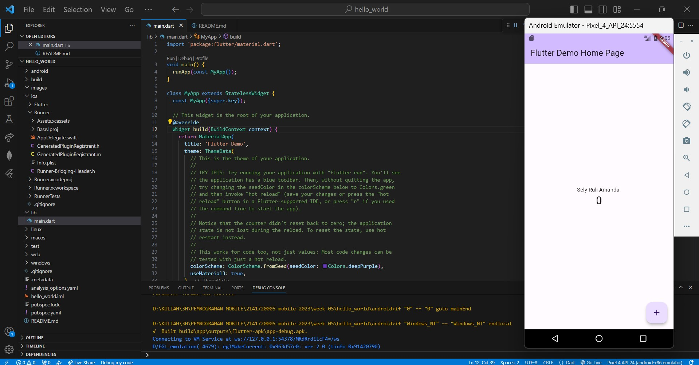
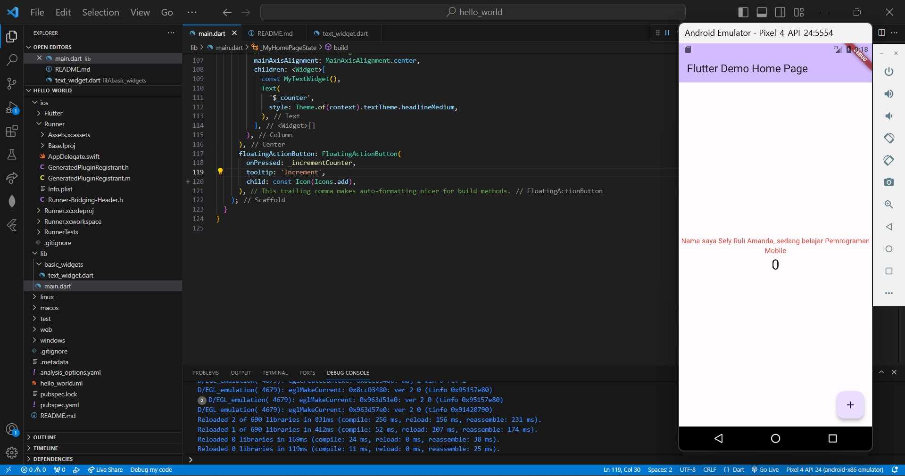
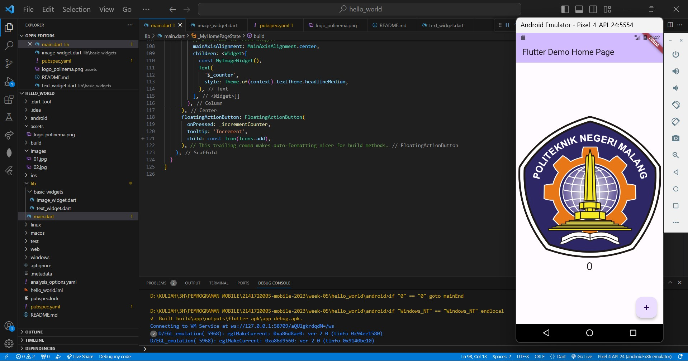
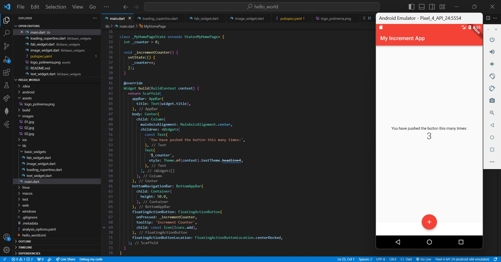
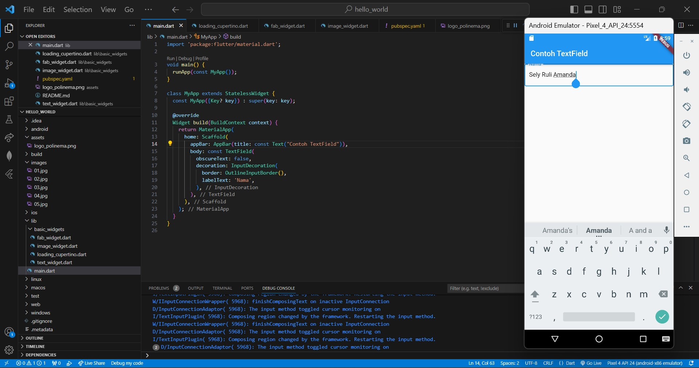
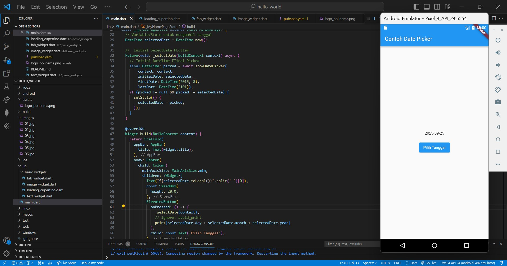

# hello_world

A new Flutter project.

Pada minggu ke-5 ini, saya mempelajari konsep dan praktik untuk dasar-dasar framework Flutter, termasuk fitur hot reload dan restart, serta widget dasar, dan tema nya. Untuk itu, sebelumnya saya telah mempersiapkan sumber daya yang dibutuhkan.

## Mencoba Running Project hello_world
dengan mengganti Text menjadi nama lengkap saya.

## Text Widget
mengganti isi teks dan warnanya menjadi merah.

## Image Widget
Kemudian menambahkan logo Polinema.

## Scaffold Widget
Implementasi scaffold widget yang digunakan untuk mengatur tata letak sesuai dengan material design.

## Dialog Widget
Menambahkan alert dialog.

## Input and Selection Widget
Menambahkan widget berupa input field untuk menerima inputan dari user, di sini saya menambahkan TextField.

## Date and Time Picker
Menambahkan date and time picker, yang dapat menerima input berupa selection (pemilihan tanggal dan waktu).

