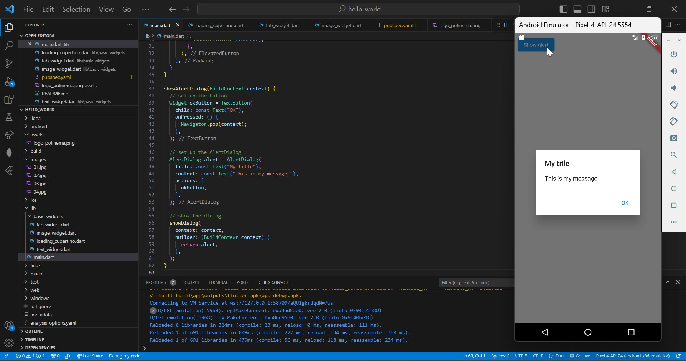
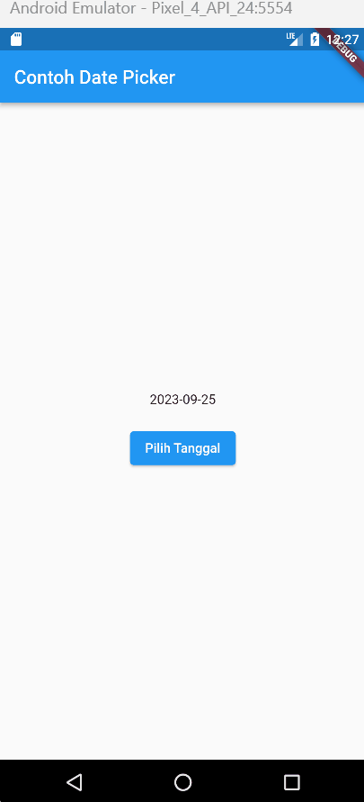
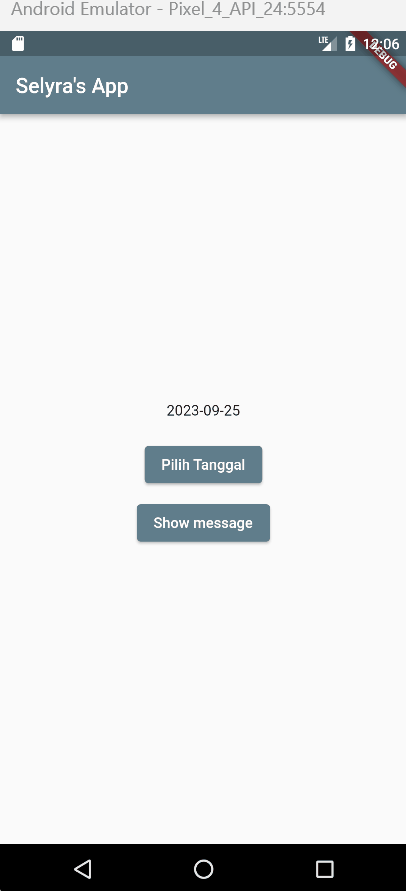

# hello_world

A new Flutter project.

Pada minggu ke-5 ini, saya mempelajari konsep dan praktik untuk dasar-dasar framework Flutter, termasuk fitur hot reload dan restart, serta widget dasar, dan tema nya. Untuk itu, sebelumnya saya telah mempersiapkan sumber daya yang dibutuhkan.

## Mencoba Running Project hello_world
dengan mengganti Text menjadi nama lengkap saya.

## Text Widget
mengganti isi teks dan warnanya menjadi merah.

## Image Widget
Kemudian menambahkan logo Polinema.

## Scaffold Widget
Implementasi scaffold widget yang digunakan untuk mengatur tata letak sesuai dengan material design.

## Dialog Widget
Menambahkan alert dialog.

## Input and Selection Widget
Menambahkan widget berupa input field untuk menerima inputan dari user, di sini saya menambahkan TextField.

## Date and Time Picker
Menambahkan date and time picker, yang dapat menerima input berupa selection (pemilihan tanggal dan waktu).

## Tugas Praktikum
### 1. Selesaikan Praktikum 1 sampai 4, lalu dokumentasikan dan push ke repository Anda berupa screenshot setiap hasil pekerjaan beserta penjelasannya di file README.md!

Jawab:

[Praktikum 1-4 Week 5](https://github.com/selyraa/2141720005-mobile-2023/tree/main/week-05/hello_world)

### 2. Mengimplementasikan Praktikum 4 Langkah 3 - 6.

Jawab:

##### 1. Membuat file widget class MyLayout, yang berisi function untuk menampilkan alert
##### 2. Membuat file widget class MyHomePage, yang berisi function untuk menampilkan date and time picker
##### 3. Import class MyLayout pada class MyHomePage
##### 4. Panggil class MyHomePage pada main.dart

## HASIL

### 3. Selesaikan [Codelabs: Your first Flutter app](https://codelabs.developers.google.com/codelabs/flutter-codelab-first#0), lalu buatlah laporan praktikumnya dan push ke repository GitHub Anda!

Jawab:

[namer_app_sely](https://github.com/selyraa/namer_app_sely.git)

