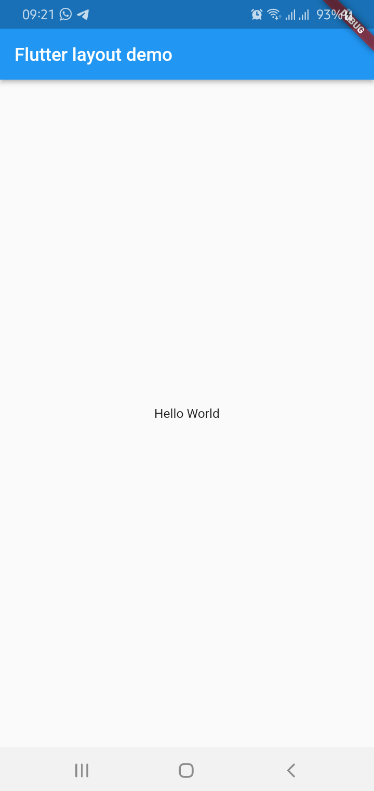
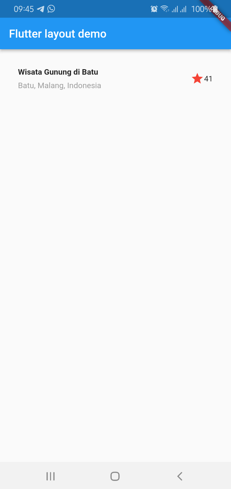
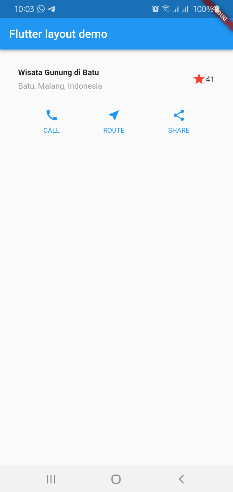
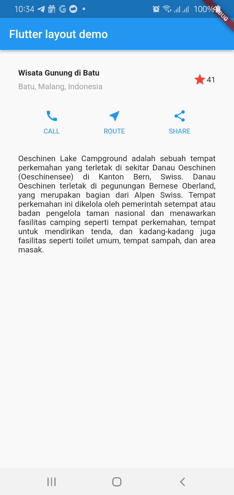
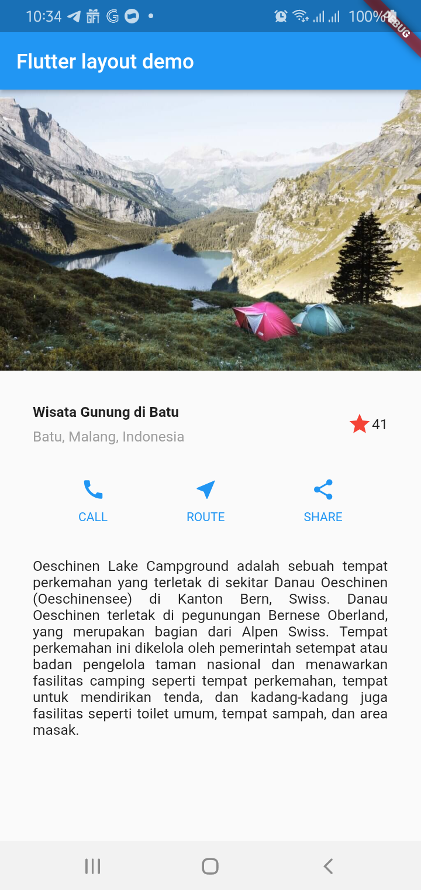

# Praktikum 1: Membangun Layout di Flutter

## Langkah 1: Buat Project Baru


## Langkah 2: Buka file lib/main.dart
### Buka file main.dart lalu ganti dengan kode berikut. Isi nama dan NIM Anda di text title.
```
import 'package:flutter/material.dart';

void main() => runApp(const MyApp());

class MyApp extends StatelessWidget {
  const MyApp({super.key});

  @override
  Widget build(BuildContext context) {
    return MaterialApp(
      title: 'Flutter layout: Nama dan NIM Anda',
      home: Scaffold(
        appBar: AppBar(
          title: const Text('Flutter layout demo'),
        ),
        body: const Center(
          child: Text('Hello World'),
        ),
      ),
    );
  }
}
```

### Hasil


## Langkah 3: Identifikasi layout diagram
Pada langkah ini dilakukan pemecahan layout menjadi elemen dasarnya:

• Identifikasi baris dan kolom

• Apakah tata letaknya menyertakan kisi-kisi (grid)?  

• Apakah ada elemen yang tumpang tindih?

• Apakah UI memerlukan tab?

• Perhatikan area yang memerlukan alignment, padding, atau borders.

Dalam hal ini menyusun elemen menjadi sebuah kolom: sebuah gambar, dua baris, dan satu blok teks. Selanjutnya, buat diagram setiap baris. Baris pertama, disebut bagian Judul, memiliki 3 anak: kolom teks, ikon bintang, dan angka. Anak pertamanya, kolom, berisi 2 baris teks. Kolom pertama itu memakan banyak ruang, sehingga harus dibungkus dengan widget yang diperluas. Baris kedua, disebut bagian Tombol, juga memiliki 3 anak: setiap anak merupakan kolom yang berisi ikon dan teks.

## Langkah 4: Implementasi title row
Menambahkan kode berikut di bagian atas metode build() di dalam kelas MyApp:
``` 
import 'package:flutter/material.dart';

void main() => runApp(MyApp());

class MyApp extends StatelessWidget {
  MyApp({super.key});

  Widget titleSection = Container(
    padding: EdgeInsets.all(32),
    child: Row(
      children: [
        Expanded(
          /* soal 1*/
          child: Column(
            crossAxisAlignment: CrossAxisAlignment.start,
            children: [
              /* soal 2*/
              Container(
                padding: const EdgeInsets.only(bottom: 8),
                child: const Text(
                  'Wisata Gunung di Batu',
                  style: TextStyle(
                    fontWeight: FontWeight.bold,
                  ),
                ),
              ),
              const Text(
                'Batu, Malang, Indonesia',
                style: TextStyle(color: Colors.grey),
              ),
            ],
          ),
        ),
        /* soal 3*/
        const Icon(Icons.star, color: Colors.red),
        const Text('41'),
      ],
    ),
  );

  @override
  Widget build(BuildContext context) {
    return MaterialApp(
      title: 'Flutter layout: Sely Ruli Amanda - 2141720005',
      home: Scaffold(
        appBar: AppBar(
          title: const Text('Flutter layout demo'),
        ),
        body: Column(
          children: [
            titleSection,
          ],
        ),
      ),
    );
  }
}
```

Dari kode di atas sudah lengkah dan sudah memenuhi spesifikasi soal yang diminta, yang mana penjelasannya sebagai berikut:

Soal 1 meminta untuk meletakkan widget Column di dalam widget Expanded. Selanjutnya diminta untuk menambahkan properti crossAxisAlignment ke CrossAxisAlignment.start sehingga posisi kolom berada di awal baris.

Soal 2 meminta untuk meletakkan baris pertama teks di dalam Container, dengan padding = 8, dengan teks 'Batu, Malang, Indonesia' di dalam Column, set warna menjadi abu-abu.

Soal 3 meminta memberikan 2 item, yaitu icon bintang dan teks '41', dengan warna merah untuk icon, dan memberi padding tepi sebesar 32 piksel. 

### Hasil


# Praktikum 2: Implementasi button row

## Langkah 1: Buat method Column _buildButtonColumn

Setelah ditambahkan method _buildButtonColumn ke dalam method build(), maka kode didalam method build() menjadi seperti kode berikut:
```
Widget build(BuildContext context) {
    Color color = Theme.of(context).primaryColor;

    Column _buildButtonColumn(Color color, IconData icon, String label) {
      return Column(
        mainAxisSize: MainAxisSize.min,
        mainAxisAlignment: MainAxisAlignment.center,
        children: [
          Icon(icon, color: color),
          Container(
            margin: const EdgeInsets.only(top: 8),
            child: Text(
              label,
              style: TextStyle(
                fontSize: 12,
                fontWeight: FontWeight.w400,
                color: color,
              ),
            ),
          ),
        ],
      );
    }
  }
```

## Langkah 2: Buat widget buttonSection
Menambahkan widget buttonSection, yang akan digunakan untuk menambahkan icon langsung ke kolom. Teks berada di dalam Container dengan margin hanya di bagian atas, yang memisahkan teks dari ikon. Kode di bawah ini digunakan untuk membangun baris yang berisi kolom-kolom dengan memanggil fungsi, dan set warna, Icon, dan teks khusus yang diatur dalam parameter ke kolom yang dituju. Kemudian 'MainAxisAlignment.spaceEvenly' digunakan untuk menyejajarkan kolom dan mengatur ruang kosong secara merata di antara kolom-kolom. 

```
Widget buttonSection = Row(
      mainAxisAlignment: MainAxisAlignment.spaceEvenly,
      children: <Widget>[
        _buildButtonColumn(
            const Color.fromRGBO(33, 150, 243, 1), Icons.call, 'CALL'),
        _buildButtonColumn(Colors.blue, Icons.near_me, 'ROUTE'),
        _buildButtonColumn(Colors.blue, Icons.share, 'SHARE'),
      ],
    );
```

## Langkah 3: Tambah button section ke body
```
body: Column(
          children: [
            titleSection,
            buttonSection,
          ],
        ),
```

### Hasil


## Praktikum 3: Implementasi text section

## Langkah 1: Buat widget textSection

Membuat widget textSection ke dalam method build()

```
Widget textSection = Container(
  padding: const EdgeInsets.all(32),
  child: const Text(
    'Carilah teks di internet yang sesuai '
    'dengan foto atau tempat wisata yang ingin '
    'Anda tampilkan. '
    'Tambahkan nama dan NIM Anda sebagai '
    'identitas hasil pekerjaan Anda. '
    'Selamat mengerjakan 🙂.',
    softWrap: true,
  ),
);
```

## Langkah 2: Tambahkan variabel text section ke body

```
body: Column(
          children: [
            titleSection,
            buttonSection,
            textSection,
          ],
        ),
```
### Hasil


## Tambahan
Untuk menambahkan gambar ke dalam body, yang terletak sebelum titleSection, maka dapat dilakukan dengan mengubah widget Column menjadi ListView untuk membuat daftar atau tampilan berulang yang dapat dilakukan *scroll* secara vertikal ataupun horizontal. Kemudian di dalam List Widget children, manambahkan sebuah gambar yang di *load* dari folder assets, yang sebelumnya telah dibuat dan juga didefinisikan pada pubspec.yaml

```
body: ListView(
          children: [
            Image.asset('assets/image_lake.jpg'),
            titleSection,
            buttonSection,
            textSection,
          ],
        ),
```

### Hasil


git