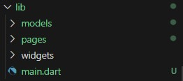

# Praktikum Minggu ke 8 - Navigasi dan Rute

## Praktikum 5 - Membangun Navigasi di Flutter
Pada praktikum 5 ini kita akan belajar mengenai pembangunan aplikasi bergerak multi halaman. Aplikasi yang dikembangkan berupa kasus daftar barang belanja. Pada aplikasi ini kita akan belajar untuk berpindah halaman dan mengirimkan data ke halaman lainnya. Desain aplikasi menampilkan sebuah ListView widget yang datanya bersumber dari List. Ketika item ditekan, data akan dikirimkan ke halaman berikutnya.

### Langkah 1: Siapkan project baru
Sebelum melanjutkan praktikum, terlebih dahulu membuat project baru Flutter dengan nama belanja, dengan membuat susunan folder sebagaimana gambar berikut. Penyusunan ini dimaksudkan untuk mengorganisasi kode dan widget yang lebih mudah.



### Langkah 2: Mendefinisikan class HomePage dan ItemPage Secara Lengkap
Mmebuat dua buah file dart dengan nama home_page.dart dan item_page.dart pada folder pages. Untuk masing-masing file, kemudian mendeklarasikan class HomePage pada file home_page.dart dan ItemPage pada item_page.dart. Kemudian membuat data model pada class HomePage, yang akan dipindahkan ke class ItemPage. Selanjutnya melengkapi class HomePage dengan membuat List item, membuat tampilan pada kedua class, dan terakhir pada class HomePage, menambahkan aksi onTap yang berisi fungsi untuk berpindah ke halaman ItemPage. 

#### 1. file item.dart

```dart
class Item {
  String name, imageUrl;
  int price, stok;
  double rating;

  Item(
      {required this.name,
      required this.price,
      required this.imageUrl,
      required this.stok,
      required this.rating});
}

```

#### 2. file home_page.dart

```dart
import 'package:belanja/models/item.dart';
import 'package:belanja/widgets/bottom_widget.dart';
import 'package:belanja/widgets/card_widget.dart';
import 'package:flutter/material.dart';

class HomePage extends StatelessWidget {
  final List<Item> items = [
    Item(
        name: 'Sugar',
        price: 5000,
        imageUrl: 'assets/sugar.jpg',
        stok: 10,
        rating: 4.3),
    Item(
        name: 'Salt',
        price: 2000,
        imageUrl: 'assets/salt.jpg',
        stok: 31,
        rating: 4.5),
    Item(
        name: 'Coffee',
        price: 17000,
        imageUrl: 'assets/coffee.jpg',
        stok: 13,
        rating: 4.1),
    Item(
        name: 'Black Pepper',
        price: 13000,
        imageUrl: 'assets/pepper.jpg',
        stok: 54,
        rating: 4.7),
    Item(
        name: 'Coriander Seed',
        price: 16500,
        imageUrl: 'assets/coriander.jpg',
        stok: 26,
        rating: 4.6),
  ];

  @override
  Widget build(BuildContext context) {
    return Scaffold(
        appBar: AppBar(
          title: const Text('Shopping List'),
        ),
        body: CardWidget(items: items),
        bottomNavigationBar: const BottomWidget());
  }
}


```
#### 3. file item_page.dart

```dart
import 'package:belanja/widgets/detailsItem_widget.dart';
import 'package:flutter/material.dart';

class ItemPage extends StatelessWidget {
  const ItemPage({super.key});

  @override
  Widget build(BuildContext context) {
    return Scaffold(
      appBar: AppBar(
        title: const Text('Item Details'),
      ),
      body: const DetailsItem(),
    );
  }
}
```
### Langkah 3: Membuat Widget
#### file card_widget.dart

```dart
import 'package:flutter/material.dart';
import 'package:belanja/models/item.dart';

class CardWidget extends StatelessWidget {
  // const CardWidget({super.key});
  final List<Item> items;

  const CardWidget({required this.items});

  @override
  Widget build(BuildContext context) {
    return Scaffold(
      body: GridView.builder(
        gridDelegate: const SliverGridDelegateWithFixedCrossAxisCount(
          crossAxisCount: 2, // Menampilkan 2 item per baris
          childAspectRatio: 0.7, // Mengatur rasio lebar-tinggi item
        ),
        itemCount: items.length,
        itemBuilder: (context, index) {
          final item = items[index];
          return ItemCard(item: item, context: context);
        },
      ),
    );
  }
}

class ItemCard extends StatelessWidget {
  final Item item;
  final BuildContext context;

  const ItemCard({required this.item, required this.context});

  @override
  Widget build(BuildContext context) {
    return InkWell(
      onTap: () {
        Navigator.pushNamed(context, '/item', arguments: item);
      },
      child: Card(
        child: Padding(
          padding: const EdgeInsets.all(
              8), // Tambahkan padding pada keseluruhan Card
          child: Column(
            crossAxisAlignment: CrossAxisAlignment.start,
            children: [
              Hero(
                tag: 'productImage${item.name}',
                child: AspectRatio(
                  aspectRatio:
                      1, // Rasio lebar-tinggi 1:1 untuk ukuran yang sama
                  child: Image.asset(item.imageUrl, fit: BoxFit.cover),
                ),
              ),
              Row(
                mainAxisAlignment: MainAxisAlignment
                    .spaceBetween, // Agar rating berada di sebelah kanan
                children: [
                  Padding(
                    padding: const EdgeInsets.only(
                        top: 8), // Padding di atas teks "name"
                    child: Text(
                      item.name,
                      style: const TextStyle(
                        fontWeight: FontWeight.bold,
                        fontSize: 16,
                      ),
                    ),
                  ),
                  Row(
                    children: [
                      const Icon(Icons.star, color: Colors.amber),
                      Text(
                        item.rating.toString(),
                        style: const TextStyle(
                          color: Colors.amber,
                          fontSize: 14,
                        ),
                      ),
                    ],
                  ),
                ],
              ),
              Padding(
                padding: const EdgeInsets.symmetric(vertical: 8),
                child: Text(
                  'Rp. ${item.price}',
                  style: const TextStyle(
                    color: Colors.deepOrange,
                    fontSize: 14,
                  ),
                ),
              ),
              Text(
                'Stok: ${item.stok}',
                style: const TextStyle(
                  color: Colors.grey,
                  fontSize: 14,
                ),
              ),
            ],
          ),
        ),
      ),
    );
  }
}
```

#### detailsItem_widget.dart

```dart
import 'package:flutter/material.dart';
import 'package:belanja/models/item.dart';

class DetailsItem extends StatelessWidget {
  const DetailsItem({super.key});

  @override
  Widget build(BuildContext context) {
    final itemArgs = ModalRoute.of(context)!.settings.arguments as Item;
    return Scaffold(
      body: Padding(
        padding: const EdgeInsets.all(16.0),
        child: Column(
          crossAxisAlignment: CrossAxisAlignment.start,
          children: [
            Hero(
              tag: 'productImage${itemArgs.name}',
              child: Image.asset(itemArgs.imageUrl),
            ),
            const SizedBox(
                height: 16), // Tambahkan jarak antara gambar dan teks
            Row(
              mainAxisAlignment: MainAxisAlignment.spaceBetween,
              children: [
                Text(
                  '${itemArgs.name}',
                  style: const TextStyle(
                    fontWeight: FontWeight.bold,
                    fontSize: 24,
                  ),
                ),
                Row(
                  children: [
                    const Icon(Icons.star, color: Colors.amber),
                    Text(
                      itemArgs.rating.toString(),
                    ),
                  ],
                ),
              ],
            ),
            const SizedBox(height: 8), // Tambahkan jarak antara nama dan harga
            Row(
              mainAxisAlignment: MainAxisAlignment.spaceBetween,
              children: [
                Text(
                  'Rp. ${itemArgs.price}',
                  style: const TextStyle(
                    color: Colors.deepOrange,
                    fontSize: 20,
                  ),
                ),
                Text(
                  'Stok: ${itemArgs.stok}',
                  style: const TextStyle(
                    color: Colors.grey,
                    fontSize: 16,
                  ),
                ),
              ],
            ),
          ],
        ),
      ),
    );
  }
}
```

#### bottom_widget.dart

```dart
import 'package:flutter/material.dart';

class BottomWidget extends StatelessWidget {
  const BottomWidget({super.key});

  @override
  Widget build(BuildContext context) {
    return BottomAppBar(
      child: Container(
        padding: const EdgeInsets.all(16),
        decoration: const BoxDecoration(
          color: Colors.blue,
        ),
        child: const Row(
          mainAxisAlignment: MainAxisAlignment.spaceBetween,
          children: [
            Text(
              'Nama: Sely Ruli Amanda',
              style: TextStyle(
                color: Colors.white,
                fontSize: 16,
              ),
            ),
            Text(
              'NIM: 2141720005',
              style: TextStyle(
                color: Colors.white,
                fontSize: 16,
              ),
            ),
          ],
        ),
      ),
    );
  }
}
```

### Langkah 4: Lengkapi Kode di main.dart
#### file main.dart

```dart
import 'package:belanja/pages/home_page.dart';
import 'package:belanja/pages/item_page.dart';
import 'package:flutter/material.dart';

void main() {
  runApp(MaterialApp(
    debugShowCheckedModeBanner: false,
    initialRoute: '/',
    routes: {
      '/': (context) => HomePage(),
      '/item': (context) => const ItemPage(),
    },
  ));
}

```
## Hasil Akhir
