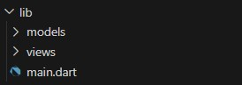
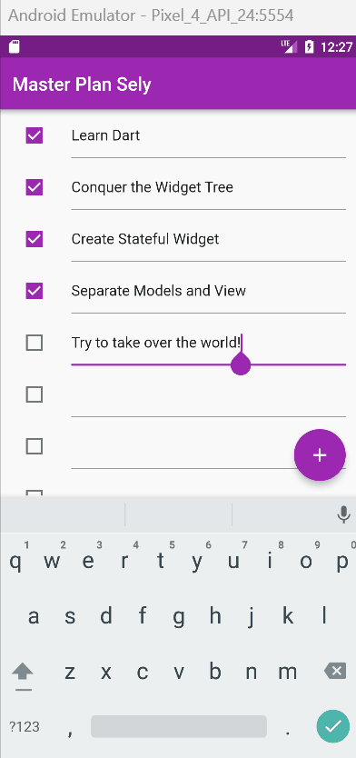
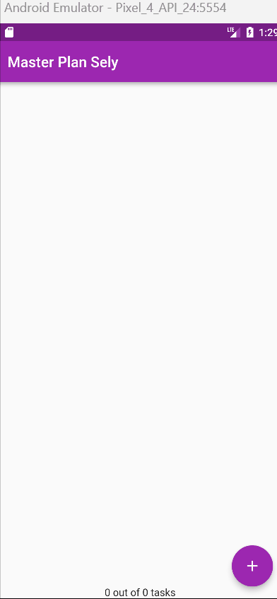
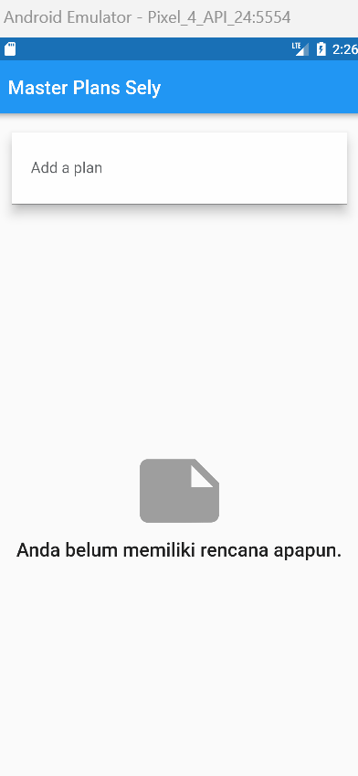

# Praktikum Minggu ke 11 - Dasar State Management

## Praktikum 1 - Dasar State dengan Model-View

## Menyiapkan project

## Tugas Praktikum 1
### 1. Selesaikan langkah-langkah praktikum tersebut, lalu dokumentasikan berupa GIF hasil akhir praktikum beserta penjelasannya di file README.md! Jika Anda menemukan ada yang error atau tidak berjalan dengan baik, silakan diperbaiki.
### Jawab:
*Done*

### 2.  Jelaskan maksud dari langkah 4 pada praktikum tersebut! Mengapa dilakukan demikian?
### Jawab:
Kode tersebut mengexport dua file atau modul Dart, yaitu 'plan.dart' dan 'task.dart'. Export digunakan untuk membuat suatu bagian dari kode atau modul yang dapat diakses dari luar file atau modul saat ini. Dengan kata lain, jika suatu file Dart lain mengimpor file yang mengandung kode tersebut, maka file yang mengimpor dapat mengakses kode yang diekspor.

### 3. Mengapa perlu variabel plan di langkah 6 pada praktikum tersebut? Mengapa dibuat konstanta?
### Jawab:
**Plan plan = const Plan();** digunakan untuk membuat objek dari kelas Plan dan menginisialisasinya dengan nilai konstan menggunakan kata kunci **const**. Penggunaan **const** pada objek menandakan bahwa objek ini merupakan objek konstan. Objek konstan memiliki nilai yang sudah diketahui pada saat kompilasi dan tidak dapat diubah selama runtime.

### 4. Lakukan capture hasil dari Langkah 9 berupa GIF, kemudian jelaskan apa yang telah Anda buat!
### Jawab:
Setelah mengikuti langkah-langkah tersebut, maka berhasil membuat aplikasi Flutter bernama "Master Plan". Aplikasi ini memiliki model data untuk tugas (Task) dan rencana (Plan). Tampilan utama (PlanScreen) menggunakan ListView.builder untuk menampilkan daftar tugas, dan pengguna dapat menambahkan tugas baru dengan tombol tambah. Setiap tugas memiliki checkbox untuk menandai keberhasilan, dan deskripsi tugas dapat diubah menggunakan TextFormField.

**Hasil Akhir**

### 5. Apa kegunaan method pada Langkah 11 dan 13 dalam lifecyle state?
### Jawab:
**Langkah 11: Tambah Scroll Listener - initState()**

Tujuannya untuk memastikan bahwa keyboard tertutup saat pengguna menggulir ListView. Dalam method initState(), ScrollController dideklarasikan dan diinisialisasi. Listener ditambahkan ke ScrollController dengan menggunakan metode addListener.
Ketika pengguna menggulir ListView, fungsi yang disediakan (FocusScope.of(context).requestFocus(FocusNode());) dipanggil, meminta fokus dari elemen yang sedang berfokus saat ini, yang mengakibatkan keyboard tertutup.

**Langkah 13: Tambah method dispose()**

Tujuannya untuk membebaskan sumber daya terkait ScrollController ketika widget tidak lagi digunakan. Dalam method dispose(), scrollController.dispose() dipanggil. Pemanggilan metode dispose() pada ScrollController adalah praktik yang baik untuk membersihkan dan membebaskan sumber daya yang digunakan oleh ScrollController.
Ini membantu mencegah kebocoran memori dan meningkatkan efisiensi penggunaan sumber daya aplikasi.

## Praktikum 2: Mengelola Data Layer dengan InheritedWidget dan InheritedNotifier

## Tugas Praktikum 2

### 1. Selesaikan langkah-langkah praktikum tersebut, lalu dokumentasikan berupa GIF hasil akhir praktikum beserta penjelasannya di file README.md! Jika Anda menemukan ada yang error atau tidak berjalan dengan baik, silakan diperbaiki sesuai dengan tujuan aplikasi tersebut dibuat.
### Jawab:
*Done*

### 2. Jelaskan mana yang dimaksud InheritedWidget pada langkah 1 tersebut! Mengapa yang digunakan InheritedNotifier?
### Jawab:
- **InheritedWidget** dalam Flutter adalah mekanisme untuk berbagi data ke bawah pohon widget. Mekanisme ini sangat berguna ketika kita memiliki data yang perlu diakses oleh beberapa widget pada level yang berbeda dalam pohon widget tanpa harus melewatkan data tersebut secara eksplisit melalui konstruktor setiap widget.
- Dalam class <kbd>plan_provider.dart</kbd>, yang dimaksud **InheritedWidget** adalah **PlanProvider**, yang merupakan **InheritedNotifier** kustom yang membungkus **ValueNotifier**. **InheritedNotifier** adalah gabungan antara **InheritedWidget** dan **ValueNotifier**. Ini memungkinkan widget mendengarkan perubahan pada ValueNotifier yang mendasarinya dan secara otomatis membangun kembali ketika nilai berubah.
- Alasan mengapa menggunakan **InheritedNotification** karena memungkinkan untuk berbagi data secara efisien ke bawah pohon widget dalam Flutter, menyederhanakan manajemen state dengan kombinasi **InheritedWidget** dan **ValueNotifier**, memastikan pembaruan otomatis widget saat nilai berubah, serta menghasilkan kode yang lebih ringkas dan bersih.

### 3. Jelaskan maksud dari method di langkah 3 pada praktikum tersebut! Mengapa dilakukan demikian?
### Jawab:
- <kbd>int get completedCount => ...</kbd> merupakan metode yang menggunakan ekspresi panjang untuk menghitung jumlah tugas yang sudah selesai dalam objek Plan. Hal itu dilakukan dengan memanfaatkan metode **where** dari Dart, yang memfilter tugas berdasarkan status selesai **(task.complete)**. Hasilnya adalah jumlah tugas yang sudah selesai.
- <kbd>String get completenessMessage => ...</kbd> merupakan metode untuk mengembalikan sebuah string yang berisi pesan mengenai sejauh mana suatu rencana (Plan) telah diselesaikan. Pesan ini mencakup jumlah tugas yang sudah selesai dan jumlah total tugas dalam rencana.
- Penambahan metode tersebut mempermudah akses informasi kemajuan rencana, menyediakan abstraksi yang baik terhadap data, dan memudahkan pemeliharaan kode dengan memusatkan logika perhitungan dalam satu tempat.
### 4. Lakukan capture hasil dari Langkah 9 berupa GIF, kemudian jelaskan apa yang telah Anda buat!

### Jawab:
Setelah mengikuti langkah-langkah tersebut, aplikasi Flutter memiliki manajemen state yang terpusat menggunakan InheritedNotifier. Pada tampilan PlanScreen, progress rencana sekarang ditampilkan dengan jelas di bagian bawah halaman, dan pembaruan UI secara otomatis merespons perubahan pada data rencana yang dikelola oleh ValueNotifier.

**Hasil Akhir**

## Praktikum 3: Membuat State di Multiple Screens

## Tugas Praktikum 3

### 1. Selesaikan langkah-langkah praktikum tersebut, lalu dokumentasikan berupa GIF hasil akhir praktikum beserta penjelasannya di file README.md! Jika Anda menemukan ada yang error atau tidak berjalan dengan baik, silakan diperbaiki sesuai dengan tujuan aplikasi tersebut dibuat.
### Jawab:
*Done*

### 2. Berdasarkan Praktikum 3 yang telah Anda lakukan, jelaskan maksud dari gambar diagram berikut ini!

### Jawab:
Diagram widget tree sebelah kiri mencerminkan struktur aplikasi saat sedang berada dalam proses pembuatan rencana baru. Pada tahap ini, pengguna berinteraksi dengan `PlanCreatorScreen`, di mana mereka dapat membuat rencana baru. Data rencana dan tampilan daftar rencana diatur oleh `PlanProvider`, yang menjadi bagian dari widget tree di bawah `MaterialApp`. Sebagai bagian dari tata letak, terdapat `Column` yang berisi `TextField` dan `Expanded` untuk menata secara vertikal dan memanfaatkan ruang yang ada.

Sementara itu, diagram widget tree sebelah kanan merepresentasikan tampilan utama (`PlanScreen`) setelah navigasi atau perubahan rute. Di sini, pengguna dapat melihat daftar rencana yang ada. Data rencana juga dikelola oleh `PlanProvider`, yang tetap berada di root widget tree untuk memungkinkan akses lintas tampilan. `Column`, `Expanded`, dan `SafeArea` digunakan untuk menyusun elemen-elemen dengan optimal, termasuk `ListView` untuk menampilkan daftar rencana. Selain itu, terdapat elemen `Text` di bawah `SafeArea` yang mungkin menampilkan pesan tentang kelengkapan rencana.

Navigasi antara kedua diagram ini terjadi saat pengguna berpindah antara langkah-langkah pembuatan rencana (`PlanCreatorScreen`) dan melihat rencana yang ada (`PlanScreen`).

### 3. Lakukan capture hasil dari Langkah 14 berupa GIF, kemudian jelaskan apa yang telah Anda buat!
### Jawab:
Setelah langkah-langkah diimplementasikan pada Praktikum 3, aplikasi Flutter "Master Plan" dapat mengelola daftar rencana melalui **PlanProvider**. Modifikasi dilakukan pada <kbd>PlanProvider</kbd>, <kbd>main.dart</kbd>, dan <kbd>plan_screen.dart</kbd> untuk mengintegrasikan manajemen state yang berpusat pada daftar rencana.

Pada <kbd>plan_screen.dart</kbd>, adanya perubahan untuk mendukung daftar rencana, termasuk penggunaan getter untuk mengakses rencana. Selain itu, diperkenalkan juga **PlanCreatorScreen** yang memungkinkan pengguna menambahkan rencana baru.

Implementasi ini memungkinkan pengguna untuk mengelola dan melihat daftar rencana dengan lebih dinamis, dan aplikasi dapat menyesuaikan tampilan sesuai dengan perubahan pada data yang dikelola.

**Hasil Akhir**

