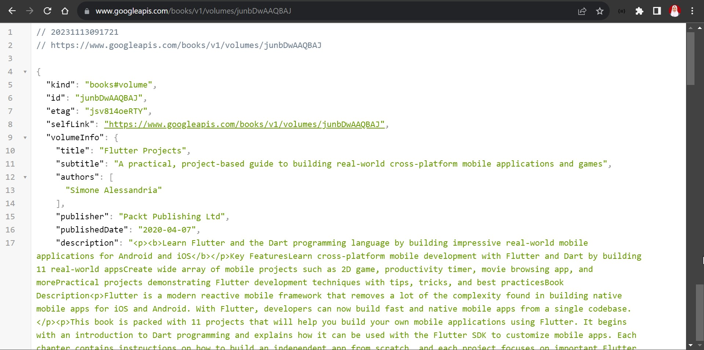
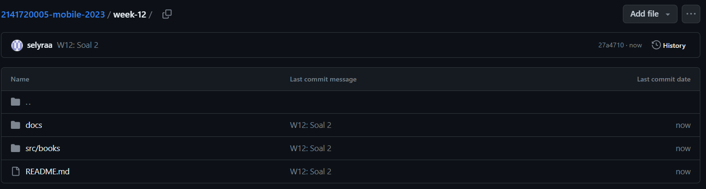
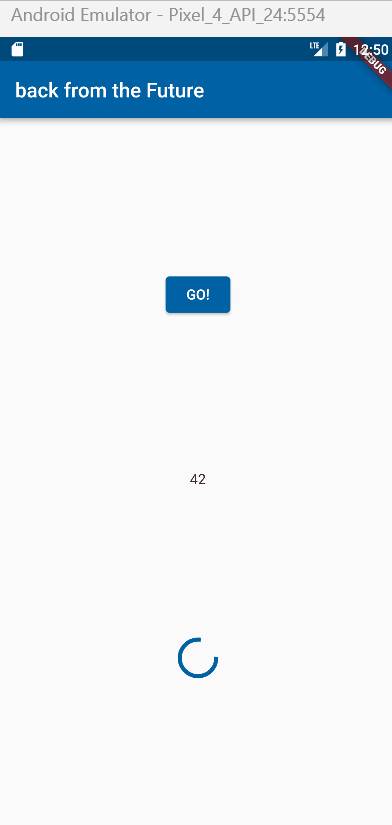
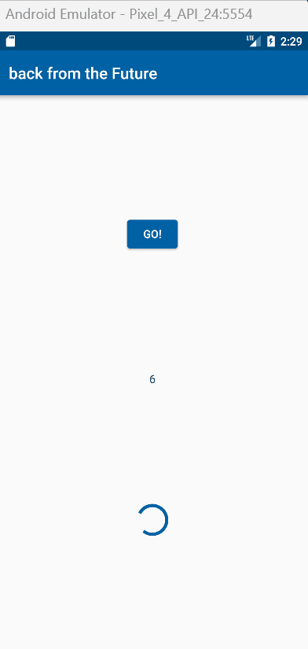

# Praktikum Minggu ke 12 - Pemrograman Asynchronous

## Praktikum 1 - Mengunduh Data dari Web Service (API)

## Soal 1
### Tambahkan **nama panggilan Anda** pada `title` app sebagai identitas hasil pekerjaan Anda.
### Jawab:

## Soal 2
### Carilah judul buku favorit Anda di Google Books, lalu ganti ID buku pada variabel path di kode tersebut. Caranya ambil di URL browser Anda seperti gambar berikut ini.
### Jawab:

### Kemudian cobalah akses di browser URI tersebut dengan lengkap seperti ini. Jika menampilkan data JSON, maka Anda telah berhasil. Lakukan capture milik Anda dan tulis di README pada laporan praktikum. Lalu lakukan commit dengan pesan "W12: Soal 2".
### Jawab:

## Soal 3
### Jelaskan maksud kode langkah 5 tersebut terkait `substring` dan `catchError`!
### Jawab:
### 1. substring
Metode substring digunakan pada objek String untuk mengambil potongan dari string tersebut. `substring(0, 450)` digunakan untuk mengambil karakter dari indeks 0 hingga indeks 449 dari string tersebut atau hanya mengambil 450 karakter dari respon HTTP yang didapatkan. 
### 2. catchError
Metode `catchError` digunakan dalam konteks Future (keluaran dari fungsi `getData()`). Jika Future menghasilkan error, maka blok kode dalam `catchError` akan dijalankan. Dalam hal ini, jika terjadi kesalahan selama pemanggilan `getData()`, blok kode `result = 'An error occurred'; setState(() {});` akan dieksekusi. Ini akan menetapkan string "An error occurred" ke variabel `result` dan kemudian memicu pembaruan ke tampilan melalui `setState`.
### Capture hasil praktikum Anda berupa GIF dan lampirkan di README. Lalu lakukan commit dengan pesan "W12: Soal 3".
### Jawab:

## Praktikum 2: Menggunakan await/async untuk menghindari callbacks

### Soal 4
### Jelaskan maksud kode langkah 1 dan 2 tersebut!
### Jawab:
- `returnOneAsync()`, `returnTwoAsync()`, `returnThreeAsync()`: Tiga fungsi ini masing-masing mengembalikan objek Future dengan tipe data int. Setiap fungsi menunggu selama 3 detik menggunakan await `Future.delayed(const Duration(seconds: 3));` sebelum mengembalikan nilai tertentu (1, 2, atau 3).
- count(): Fungsi count merupakan sebuah fungsi Future yang juga menggunakan kata kunci `async`. Di dalamnya, ada variabel lokal total yang diinisialisasi dengan nilai 0. Kemudian, fungsi `returnOneAsync()` dipanggil dengan menggunakan `await`, yang berarti eksekusi fungsi ini akan ditunda hingga hasilnya siap. Nilai yang dikembalikan dari `returnOneAsync()` ditambahkan ke variabel total. Proses yang sama dilakukan untuk `returnTwoAsync()` dan `returnThreeAsync()`. Setelah semuanya selesai, nilai total diubah menjadi string dan disimpan di variabel result. Terakhir, fungsi `setState` dipanggil. Ini biasanya digunakan dalam Flutter untuk memberi tahu framework bahwa ada perubahan dalam state dan perlu memperbarui tampilan.
### Capture hasil praktikum Anda berupa GIF dan lampirkan di README. Lalu lakukan commit dengan pesan "W12: Soal 4".
### Jawab:

## Praktikum 3: Menggunakan Completer di Future
### Soal 5
### Jelaskan maksud kode langkah 2 tersebut!
### Jawab:
Variabel `completer` digunakan untuk mengontrol dan menyelesaikan suatu `Future` secara manual. Dengan menggunakan `Completer`, Anda dapat menentukan kapan suatu `Future` dianggap selesai (completed). Kemudian dalam method `getNumber()`, `completer` diinisialisasi sebagai objek `Completer<int>`, lalu dipanggil method `calculate()` yang menjalankan tugas yang memerlukan waktu. Setelah tugas selesai, `completer.complete()` digunakan untuk menyelesaikan `Future` terkait dengan nilai 42. Method `getNumber` mengembalikan `completer.future`, memungkinkan pengguna untuk menunggu hingga perhitungan selesai. Dengan demikian, kode ini menciptakan suatu struktur yang memberikan kendali manual terhadap penyelesaian suatu `Future`, berguna ketika kita ingin mengendalikan kapan suatu operasi asynchronous dianggap selesai dan nilai dari operasi tersebut dapat diakses.
### Capture hasil praktikum Anda berupa GIF dan lampirkan di README. Lalu lakukan commit dengan pesan "W12: Soal 5".
### Jawab:

### Soal 6
### Jelaskan maksud perbedaan kode langkah 2 dengan langkah 5-6 tersebut!
### Jawab:
- Pada Langkah 5 perbedaannya terletak pada method `calculate()`. Kode sebelumnya tanpa meng-handle error secara eksplisit. Jika terjadi kesalahan selama penundaan, `completer.complete(42);` dijalankan tanpa meng-handle atau menyatakan jenis kesalahan yang mungkin terjadi. Untuk kode setelah diubah terdapat penambahan struktur try-catch. Jika terjadi kesalahan selama penundaan, `completer.completeError({});` dijalankan, yang menandakan bahwa terjadi kesalahan dan memberikan objek kosong sebagai payload error.
- Pada Langkah 6 perbedaanya terletak pada `onPressed()`. Kode sebelumnya menggunakan `catchError` pada `Future` hasil dari `getNumber()`. Jika ada kesalahan, string "An error occurred" ditetapkan pada variabel `result`. Untuk kode setelah diubah menggunakan `blok` then dan `catchError` langsung pada pemanggilan `getNumber()`. Jika sukses, hasil perhitungan diubah menjadi string dan disetel pada variabel `result`. Jika ada kesalahan, string "An error occurred" ditetapkan pada variabel `result`.
### Soal 7
### Capture hasil praktikum Anda berupa GIF dan lampirkan di README. Lalu lakukan commit dengan pesan "W12: Soal 6".
### Jawab:

## Praktikum 4: Memanggil Future secara paralel
### Capture hasil praktikum Anda berupa GIF dan lampirkan di README. Lalu lakukan commit dengan pesan "W12: Soal 7".
### Jawab:

### Soal 8
### Jelaskan maksud perbedaan kode langkah 1 dan 4!
### Jawab:
Perbedaan Kode pada langkah 1 dan 4
- Langkah 1 menggunakan `FutureGroup` untuk mengelola sejumlah future secara manual. `FutureGroup` memungkinkan kita menambahkan future satu per satu dan menutupnya agar tidak dapat menambahkan future lagi. Setelah itu menggunakan loop `for` untuk menjumlahkan hasil dari semua future yang dijalankan. Setelah semua future selesai, hasilnya diubah menjadi string dan diatur dalam `setState` untuk memperbarui tampilan.
- Langkah 4 menggunakan `Future.wait` untuk menunggu sampai semua future selesai. `Future.wait` mengembalikan future tunggal yang menunggu sampai semua future dalam daftar selesai. Setelah itu menggunakan loop `for` untuk menjumlahkan hasil dari semua future yang dijalankan. Setelah semua future selesai, hasilnya diubah menjadi string dan diatur dalam `setState` untuk memperbarui tampilan.

## Praktikum 5: Menangani Respon Error pada Async Code

### Soal 9
### Capture hasil praktikum Anda berupa GIF dan lampirkan di README. Lalu lakukan commit dengan pesan "W12: Soal 9".
### Jawab:

### Soal 10
### Panggil method handleError() tersebut di ElevatedButton, lalu run. Apa hasilnya? Jelaskan perbedaan kode langkah 1 dan 4!
### Jawab:
Setelah method `handleError()` dipanggil, maka outputnya akan tetap sama, pesan kesalahan 'Exception: Something terrible happened!' akan tetap ditampilkan. Namun kedua kode pada langkah 1 dan 4 tersebut memiliki perbedaan dalam menangani error yang terjadi.
- Langkah 1 menggunakan `then` untuk menangani hasil sukses dari `returnError()`. Kemudian menggunakan `catchError` untuk menangkap dan menangani kesalahan yang mungkin terjadi selama operasi asynchronous.
Terakhir, menggunakan `whenComplete` untuk menentukan tindakan yang akan dilakukan setelah operasi selesai, baik dengan sukses atau dengan kesalahan.
- Langkah 4 menggunakan blok `try-catch` untuk menangkap kesalahan yang mungkin terjadi selama operasi asynchronous. Dengan menggunakan `try-catch ` ini akan mengizinkan lebih banyak kontrol atas kode yang dijalankan ketika kesalahan terjadi dan memberikan pesan kesalahan di dalam `result`. Jika ada kesalahan, hasil kesalahan dikirim ke dalam `setState` untuk pembaruan tampilan.
Blok `finally` akan selalu dijalankan, baik operasi berhasil atau gagal.

Jadi, jika operasi `returnError()` berhasil, maka 'Success' akan ditampilkan di dalam variabel `result`. Jika terjadi kesalahan, pesan kesalahan yang dihasilkan oleh `Exception` akan ditampilkan. Selain itu, pesan 'Complete' akan dicetak ke konsol dalam kedua kasus, karena blok `whenComplete` atau `finally` selalu dijalankan.

## Praktikum 6: Menggunakan Future dengan StatefulWidget

### Soal 11
### Tambahkan nama panggilan Anda pada tiap properti title sebagai identitas pekerjaan Anda.
### Jawab:

