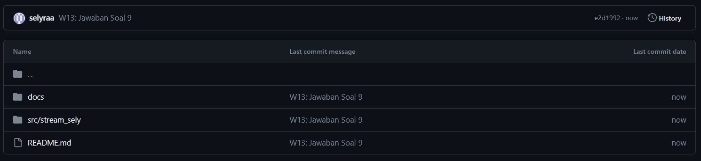

# Praktikum Minggu ke 13 - Lanjutan State Management dengan Streams

## Praktikum 1 - Dart Streams

### Soal 1
### Tambahkan **nama panggilan Anda** pada `title` app sebagai identitas hasil pekerjaan Anda.
### Gantilah warna tema aplikasi sesuai kesukaan Anda.
### Lakukan commit hasil jawaban Soal 1 dengan pesan "W13: Jawaban Soal 1"
### Jawab:

### Soal 2
### Tambahkan 5 warna lainnya sesuai keinginan Anda pada variabel colors tersebut.
### Lakukan commit hasil jawaban Soal 2 dengan pesan "W13: Jawaban Soal 2"
### Jawab:

### Soal 3
### Jelaskan fungsi keyword yield* pada kode tersebut!
### Jawab:
Di dalam Dart, keyword `yield*` digunakan untuk menghasilkan nilai-nilai dari suatu stream. Keyword ini akan menghubungkan atau 'melempar' nilai-nilai dari stream ke dalam stream lainnya. Jadi ketika terdapat async* dan yield*, maka kode tersebut digunakan untuk menghasilkan suatu nilai dari stream secara berurutan, tanpa perlu secara eksplisit mengeluarkan setiap nilai satu per satu.
### Apa maksud isi perintah kode tersebut?
### Jawab:
Kode tersebut mendefinisikan kelas `ColorStream` yang memiliki metode `getColors` sebagai asynchronous generator function, yang mana akan menghasilkan stream warna yang berulang setiap detik, dengan warna yang ditampilkan merupakan warna yang diambil dari daftar warna yang telah ditentukan.

### Lakukan commit hasil jawaban Soal 3 dengan pesan "W13: Jawaban Soal 3"
### Jawab:

### Soal 4
### Capture hasil praktikum Anda berupa GIF dan lampirkan di README.
### Lakukan commit hasil jawaban Soal 4 dengan pesan "W13: Jawaban Soal 4"
### Jawab:

### Soal 5
### Jelaskan perbedaan menggunakan listen dan await for (langkah 9) !
### Lakukan commit hasil jawaban Soal 5 dengan pesan "W13: Jawaban Soal 5"

### Jawab:
Perbedaan menggunakan `listen` dan `await for`

- `await for` digunakan untuk mendengarkan stream secara langsung di dalam metode `changeColor()`. Hal ini memungkinkan penggunaan `await`, sehingga proses yang ada di dalam blok perulangan akan menunggu hingga stream mengeluarkan nilai sebelum melanjutkan ke langkah berikutnya. Dalam konteks ini, setiap kali stream mengeluarkan nilai baru(warna baru), blok `setState` akan dieksekusi untuk memperbarui tampilan.
- `listen` digunakan untuk menambahkan listener ke dalam stream. Dalam hal ini, setiap kali stream mengeluarkan nilai baru, callback yang ada dalam `listen` akan dipanggil. Dalam kode ini, tidak ada penggunaan `await`, sehingga pembaruan tampilan dapat terjadi secara asynchronous, dan blok `setState` akan dieksekusi setiap kali stream mengeluarkan nilai baru.
- Pada intinya, `await for` digunakan ketika kita ingin menunggu setiap iterasi (stream mengeluarkan iterasi) selesai sebelum melanjutkan ke iterasai selanjutnya. Sedangkan `listen` digunakan ketika ingin menangani nilai secara asinkron, tanpa perlu menunggu satu iterasi seelsai sebelum melanjutkan ke iterasi berikutnya.  

## Praktikum 2: Stream controllers dan sinks

### Soal 6
### Jelaskan maksud kode langkah 8 dan 10 tersebut!
### Jawab:
Maksud dari kode pada langkah 8 dan langkah 10
- Langkah 8: pada kode ini, awalnya membuat objek `NumberStream` yang menyediakan suatu steam controller. Saat aplikasi diinisialisasi, kita menghubungkan controller tersebut ke suatu stream. Ketika stream mengeluarkan nilai baru, sebagai contoh adalah angka baru, maka tampilan akan diperbarui dengan nilai baru tersebut melalui `setState()`.
- Langkah 10: pada langkah ini membuat suatu metode yang akan menambahkan angka random atau acak ke dalam stream. Metode ini menggunakan objek `Random` untuk menghasilkan angka acak. Kemudian angka acak tersebut ditambahkan ke dalam stream menggunakan metode `addNumberToSink` pada objek `numberStream`.
### Capture hasil praktikum Anda berupa GIF dan lampirkan di README.
### Lalu lakukan commit dengan pesan "W13: Jawaban Soal 6".
### Jawab:

### Soal 7
### Jelaskan maksud kode langkah 13 sampai 15 tersebut!
### Jawab:
Kode pada langkah 13 sampai 15 tersebut akan membuat handling ketika terjadi error menggunakan metode `addError()` pada class stream.dart. Jika terjadi error atau kesalahan selama proses iterasi atau ketika stream mengembalikan nilai, maka nilai dari `lastNumber` diatur menjadi -1.

### Kembalikan kode seperti semula pada Langkah 15, comment addError() agar Anda dapat melanjutkan ke praktikum 3 berikutnya. Lalu lakukan commit dengan pesan "W13: Jawaban Soal 7".
### Jawab:
*Done*

## Praktikum 3: Injeksi data ke streams

### Soal 8
### Jelaskan maksud kode langkah 1-3 tersebut!
### Jawab:

### Capture hasil praktikum Anda berupa GIF dan lampirkan di README. Lalu lakukan commit dengan pesan "W13: Jawaban Soal 8".
### Jawab:

## Praktikum 4: Subscribe ke stream events
### Soal 9
### Jelaskan maksud kode langkah 2, 6 dan 8 tersebut!
### Jawab:

- .jpg)

- Langkah 2: kode tersebut digunakan untuk melakukan susbcribe atau langganan pada stream agar dapat mendapatkan informasi atau output dari stream.

- .jpg)

- Langkah 6: kode tersebut digunakan untuk membatalkan atau menghentikan subscribe pada stream. Jadi ketika screen tidak lagi ditampilkan, metode ini akan dipanggil. Hal ini berguna untuk membersihkan sumber daya dan akan menghemat penyimpanan. 

- .jpg)

- Langkah 8: Pada kode tersebut terdapat suatu kondisi, yaitu apabila stream tidak ditutup, maka angka yang akan dihasilkan atau ditampilkan adalah angka yang sesuai dengan hasil randomize. Namun, jika stream sudah ditutup atau subscription telah dihentikan, maka akan menampilkan angka -1.

### Capture hasil praktikum Anda berupa GIF dan lampirkan di README. Lalu lakukan commit dengan pesan "W13: Jawaban Soal 9".
### Jawab:

## Praktikum 5: Multiple stream subscriptions

### Soal 10
### Jelaskan mengapa error itu bisa terjadi?
### Jawab:

Error tersebut terjadi ketika mencoba untuk menambahkan atau membuat dua subscription pada stream yang sama, tanpa membatalkan subscription sebelumnya. Hal tersebut terjadi ketika inisialisasi subsription2 pada metode initState() karena sudah ada inisialisasi subsription untuk menangani stream yang sama pada satu waktu.

### Soal 11
### Jelaskan mengapa hal itu bisa terjadi ?
### Jawab:
Ketika button 'New Random Number' ditekan, maka akan menghasilkan dua angka yang sama. Hal ini merupakan output dari stream yang dipanggil oleh objek `subscription` dan `subscription2`, yang akan mengembalikan value berupa event (angka random) yang dipisahkan dengan tanda '-'. Ketika button Stop Stream ditekan, maka akan menghentikan langganan terhadap stream, dan tidak lagi bisa mengeluarkan output meskipun button 'New Random Number' ditekan. 
### Capture hasil praktikum Anda berupa GIF dan lampirkan di README. Lalu lakukan commit dengan pesan "W13: Jawaban Soal 10,11".
### Jawab:

## Praktikum 6: StreamBuilder

### Soal 12
### Jelaskan maksud kode pada langkah 3 dan 7!
### Jawab:
- .jpg)
- Langkah 3: kode tersebut mendefinisikan class `NumberStream()` yang memiliki metode `getNumbers()` untuk mengembalikan stream berisi angka acak dengan periode waktu selama 1 detik. 
- .jpg)
- Langkah 7: kode tersebut digunakan untuk membuat tampilan UI untuk menampilkan nilai dari stream secara real-time. Dengan menggunakan `StreamBuilder`, antarmuka akan diperbarui secara otomatis setiap kali ada perubahan stream, baik itu perubahan value atau ketika terdapat error. Terdapat kondisi ketika terjadi error maka akan menampilkan pesan 'Error!', ketika tidak terjadi error dan mendapatkan data dari stream maka akan menampilkan angka acak dengan gaya fontSize diatur sebesar 96, namun apabila tidak ada data yang diterima maka akan menampilkan widget kosong. 
### Capture hasil praktikum Anda berupa GIF dan lampirkan di README. Lalu lakukan commit dengan pesan "W13: Jawaban Soal 12".
### Jawab:

