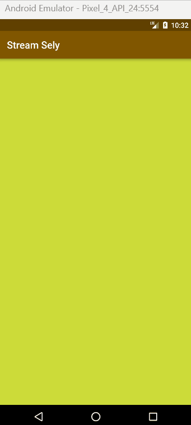

# Praktikum Minggu ke 13 - Lanjutan State Management dengan Streams

## Praktikum 1 - Dart Streams

### Soal 1
### Tambahkan **nama panggilan Anda** pada `title` app sebagai identitas hasil pekerjaan Anda.
### Gantilah warna tema aplikasi sesuai kesukaan Anda.
### Lakukan commit hasil jawaban Soal 1 dengan pesan "W13: Jawaban Soal 1"
### Jawab:

### Soal 2
### Tambahkan 5 warna lainnya sesuai keinginan Anda pada variabel colors tersebut.
### Lakukan commit hasil jawaban Soal 2 dengan pesan "W13: Jawaban Soal 2"
### Jawab:

### Soal 3
### Jelaskan fungsi keyword yield* pada kode tersebut!
### Jawab:
Di dalam Dart, keyword `yield*` digunakan untuk menghasilkan nilai-nilai dari suatu stream. Keyword ini akan menghubungkan atau 'melempar' nilai-nilai dari stream ke dalam stream lainnya. Jadi ketika terdapat async* dan yield*, maka kode tersebut digunakan untuk menghasilkan suatu nilai dari stream secara berurutan, tanpa perlu secara eksplisit mengeluarkan setiap nilai satu per satu.
### Apa maksud isi perintah kode tersebut?
### Jawab:
Kode tersebut mendefinisikan kelas `ColorStream` yang memiliki metode `getColors` sebagai asynchronous generator function, yang mana akan menghasilkan stream warna yang berulang setiap detik, dengan warna yang ditampilkan merupakan warna yang diambil dari daftar warna yang telah ditentukan.

### Lakukan commit hasil jawaban Soal 3 dengan pesan "W13: Jawaban Soal 3"
### Jawab:

### Soal 4
### Capture hasil praktikum Anda berupa GIF dan lampirkan di README.
### Lakukan commit hasil jawaban Soal 4 dengan pesan "W13: Jawaban Soal 4"
### Jawab:

### Soal 5
### Jelaskan perbedaan menggunakan listen dan await for (langkah 9) !
### Lakukan commit hasil jawaban Soal 5 dengan pesan "W13: Jawaban Soal 5"

### Jawab:
Perbedaan menggunakan `listen` dan `await for`

- `await for` digunakan untuk mendengarkan stream secara langsung di dalam metode `changeColor()`. Hal ini memungkinkan penggunaan `await`, sehingga proses yang ada di dalam blok perulangan akan menunggu hingga stream mengeluarkan nilai sebelum melanjutkan ke langkah berikutnya. Dalam konteks ini, setiap kali stream mengeluarkan nilai baru(warna baru), blok `setState` akan dieksekusi untuk memperbarui tampilan.
- `listen` digunakan untuk menambahkan listener ke dalam stream. Dalam hal ini, setiap kali stream mengeluarkan nilai baru, callback yang ada dalam `listen` akan dipanggil. Dalam kode ini, tidak ada penggunaan `await`, sehingga pembaruan tampilan dapat terjadi secara asynchronous, dan blok `setState` akan dieksekusi setiap kali stream mengeluarkan nilai baru.
- Pada intinya, `await for` digunakan ketika kita ingin menunggu setiap iterasi (stream mengeluarkan iterasi) selesai sebelum melanjutkan ke iterasai selanjutnya. Sedangkan `listen` digunakan ketika ingin menangani nilai secara asinkron, tanpa perlu menunggu satu iterasi seelsai sebelum melanjutkan ke iterasi berikutnya.  

## Praktikum 2: Stream controllers dan sinks

### Soal 6
### Jelaskan maksud kode langkah 8 dan 10 tersebut!
### Jawab:
Maksud dari kode pada langkah 8 dan langkah 10
- Langkah 8: pada kode ini, awalnya membuat objek `NumberStream` yang menyediakan suatu steam controller. Saat aplikasi diinisialisasi, kita menghubungkan controller tersebut ke suatu stream. Ketika stream mengeluarkan nilai baru, sebagai contoh adalah angka baru, maka tampilan akan diperbarui dengan nilai baru tersebut melalui `setState()`.
- Langkah 10: pada langkah ini membuat suatu metode yang akan menambahkan angka random atau acak ke dalam stream. Metode ini menggunakan objek `Random` untuk menghasilkan angka acak. Kemudian angka acak tersebut ditambahkan ke dalam stream menggunakan metode `addNumberToSink` pada objek `numberStream`.
### Capture hasil praktikum Anda berupa GIF dan lampirkan di README.
### Lalu lakukan commit dengan pesan "W13: Jawaban Soal 6".
### Jawab:
